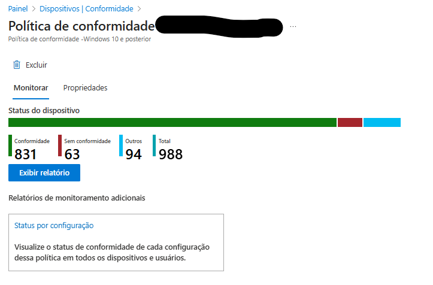
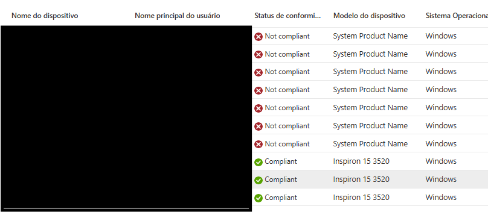

Criação de grupo de exceção para dispositivos não compatíveis com BitLocker
Contexto

Em ambientes gerenciados pelo Microsoft Intune, é comum que políticas de conformidade exijam BitLocker habilitado. No entanto, alguns dispositivos mais antigos ou com SSDs incompatíveis não conseguem atender a esse requisito técnico, passando a constar como "Não conformes" nos relatórios.

Esse cenário gera dois problemas práticos:

Relatórios de conformidade que não refletem a realidade operacional do parque.

Pressão sobre times de TI, mesmo quando a limitação é estrutural (hardware).

Este guia documenta uma prática controlada e provisória: a criação de um grupo de exceção para esses dispositivos, permitindo relatórios mais fiéis, sem mascarar riscos ou descartar boas práticas de segurança.

⚠️ Importante: esta abordagem não substitui a modernização do parque. Ela deve ser tratada como medida temporária, com rastreabilidade e revisão periódica.

Objetivo

Identificar dispositivos que não suportam BitLocker por limitação de SSD

Criar um grupo dedicado de exceção no Entra ID / Intune

Ajustar a política de conformidade para excluir apenas esse grupo

Manter relatórios claros, auditáveis e tecnicamente honestos

Passo 1 – Identificar os dispositivos não compatíveis

Acesse o Microsoft Intune Admin Center

Vá em:

Dispositivos → Monitoramento → Conformidade

Filtre os dispositivos Não conformes

Analise o motivo da não conformidade:

BitLocker não habilitado

Erros relacionados a hardware / SSD / criptografia não suportada

Dica: sempre valide se o problema é realmente incompatibilidade física, e não falha de configuração ou política.

Passo 2 – Criar um grupo de exceção

Acesse o Centro de administração do Entra ID

Vá em Grupos → Novo grupo

Configure:

Tipo: Segurança

Nome: EXC-BitLocker-SSD-Incompativel

Descrição:

Dispositivos com limitação de hardware (SSD incompatível) para BitLocker. Grupo de exceção provisório.

Adicione manualmente os dispositivos identificados no passo anterior

✅ Recomendação: manter a inclusão manual para evitar crescimento descontrolado do grupo.

Passo 3 – Ajustar a política de conformidade

No Intune Admin Center, vá em:

Dispositivos → Políticas de conformidade

Selecione a política que exige BitLocker

Em Atribuições:

Excluir o grupo EXC-BitLocker-SSD-Incompativel

Salve as alterações

Com isso:

Os dispositivos permanecem visíveis e rastreados

Não impactam negativamente os relatórios globais de conformidade

Passo 4 – Validação nos relatórios

Após a sincronização:

Os dispositivos do grupo de exceção deixam de aparecer como não conformes por BitLocker

A conformidade geral passa a refletir melhor a realidade técnica do ambiente

⚠️ Isso não significa que os dispositivos estejam protegidos por BitLocker — apenas que estão formalmente justificados.

Boas práticas e governança

📌 Documentar o motivo da exceção

📌 Revisar o grupo periodicamente (ex: trimestral)

📌 Usar o grupo como insumo para planejamento de renovação de hardware

📌 Evitar exceções amplas ou automáticas

Nota importante (mensagem para gestores e auditorias)

Esta exceção foi criada exclusivamente para lidar com limitações técnicas de hardware legado. Trata-se de uma medida provisória, adotada para garantir transparência nos relatórios de conformidade, sem comprometer a governança de segurança.

A recomendação oficial permanece sendo a substituição gradual dos dispositivos incompatíveis, permitindo a aplicação integral das políticas de proteção, como o BitLocker.

Conclusão

Criar grupos de exceção não é enfraquecer a segurança, quando feito com critério, documentação e prazo. Pelo contrário: é uma forma madura de alinhar segurança, realidade operacional e comunicação executiva, especialmente em ambientes com restrições orçamentárias e parque heterogêneo.

📁 Este repositório documenta uma prática real de campo, voltada a analistas de segurança e administradores de endpoint que precisam entregar relatórios claros, defensáveis e tecnicamente corretos.
